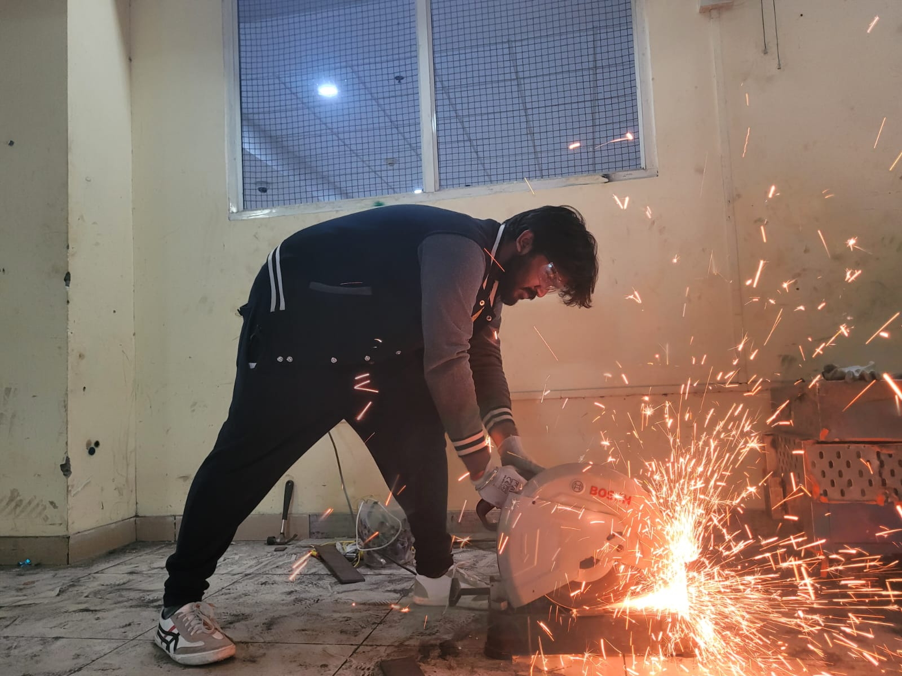
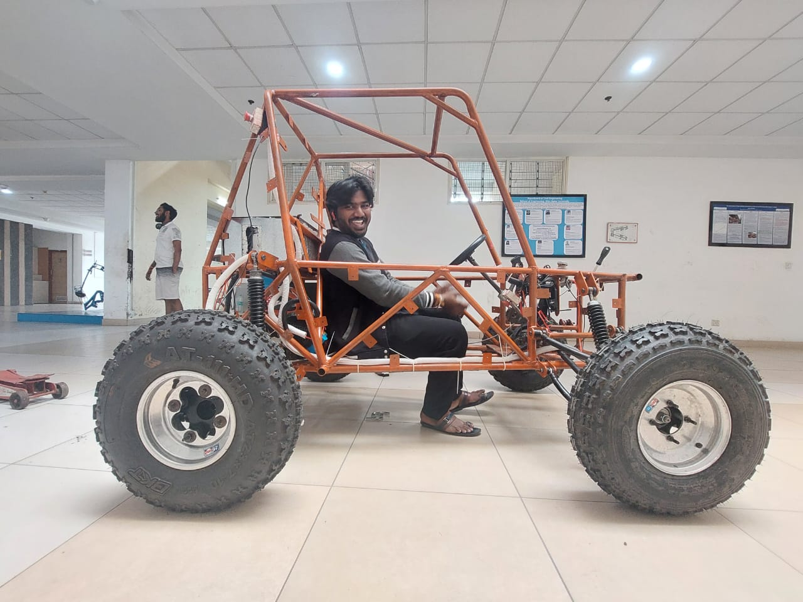

# Electrical Engineer

#### Technical Skills: MATLAB, CST Studio, KiCad, Arduino IDE, C++

## Work Experience
**Control and Automation Intern @ Tecnimont Pvt Ltd (_June 2023 - July 2023_)**
-Learned to design and implementation of a gas plants control algorithm. 
-Training in designing of PLC controller.

**Teaching Assistant (_Jan 2024 - Present_)**
- Software radio-based lab work. The task is to create a set of communications-related experiments on the Software radio platform for the 2nd year UG lab.
- Software's Used: MATLAB Simulink.

  **Hostel Representative (_Sept 2022 - May 2023_)**

## Education
- B Tech, Electronics and Communication | Shiv Nadar University 
- 12th | SBOA Junior College | 90.2%
- 10th | SBOA Junior College | 82.2%

## Projects
### Design and Implementation of an IoT Health Monitoring Device.
- The project's goal is to design and implement a three-stage power supply system for a Wearable IoT (WIoT) device intended for health monitoring on a Printed Circuit Board (PCB).
- Software's Used: KiCad, Arduino.
  
### Remote Health Monitoring System
- The project leverages the Internet of Things (IoT) to provide real-time health data monitoring, enabling remote healthcare services. The system integrates multiple sensors, including a Pulse Sensor for heart rate monitoring, a Temperature Sensor for body temperature tracking, and a GPS Module for location tracking.
- Software's used: Arduino IDE.
  
### Radio Frequecncy Carrier Combiner.
- The research was based simulating and fabricating an Radio Frequency Carrier Combiner resonating at Ku band.
- Software's used: CST Studio
  
  ### STM32 Vehicle Controller
- This project involves programing a motorized vehicle using the STM32 microcontroller. The vehicle is programmed to move in a desired path, and IR sensors are used to control its direction and movement along the path. 
- Software's used: STM32 IDE
  

  ## Competitions
  ### BAJA 2023
  - The Competition is based on an all India ATV Competition.
  - Part of the Suspension and Steering team and was successful in assembling the All Terrain Vehicle(ATV). Showcased the ATV in the meet held at Chitkara University, Baddi, Himachal Pradesh

## Conferences
### SNU 9th Research Conference
-During the conference at SNU, I had the opportunity to present the culmination of a year-long research endeavor. Delving into Radio Frequency Carrier combiner, my presentation showcased significant findings and insights gleaned from rigorous investigation and analysis. Engaging with fellow scholars and attendees, the session facilitated valuable discussions and contributed to the advancement of knowledge in the field.

 ## Clubs & Society
  ### IEEE Students Club | Shiv Nadar University
  ### Dauntless | Shiv Nadar University
  ### Chess Club | Shiv Nadar University
    
